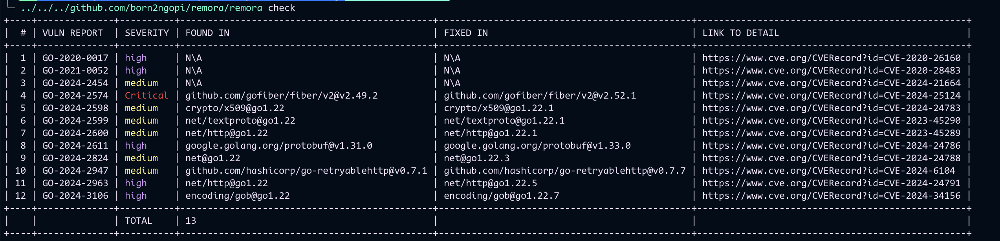

# remora

This tools for increase awernes go engineer from vulnerability on standard libary or threedparty.
Many engineers only remember when installing or adding threedparty but after that forget to always check the vuln on the installed threedparty.

## how to use:
you can install:
```shell
go install github.com/born2ngopi/remora
```
or clone and build
``` shell
git clone github.com/born2ngopi/remora && cd remora
--
go build -o remora *.go
```

to runing only on terminal
```shell
remora
```
and you got result:


to set up githook
``` shell
curl -sSL https://raw.githubusercontent.com/born2ngopi/remora/refs/heads/master/script/pre-push.sh | bash
```

the deference between with and without `--git-hook` is how application stop/quit. 
when -git-hook and if any critycal or, >4 high or >6 medium severity the application will stop os.Exist(1).
then you can handle the logic